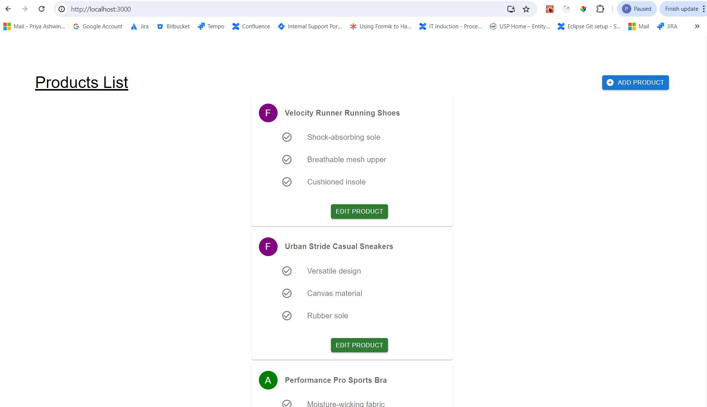
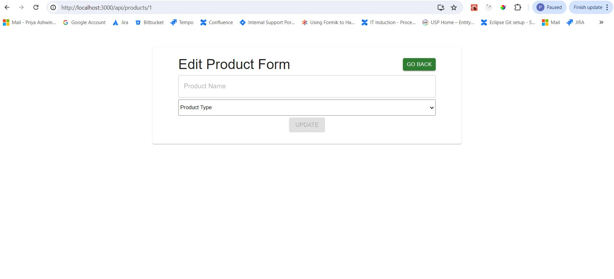
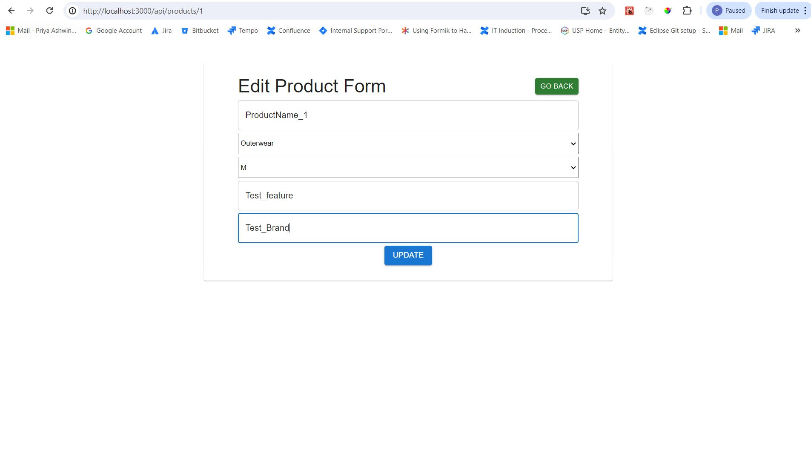
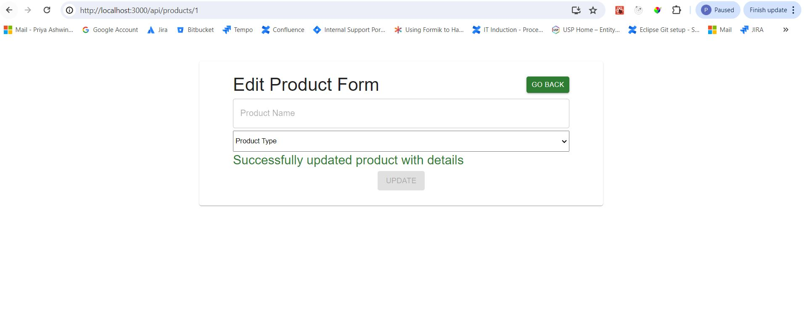
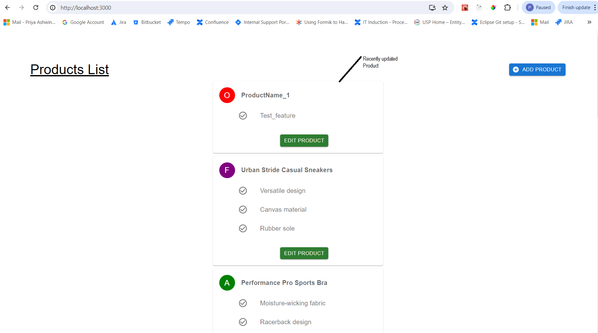
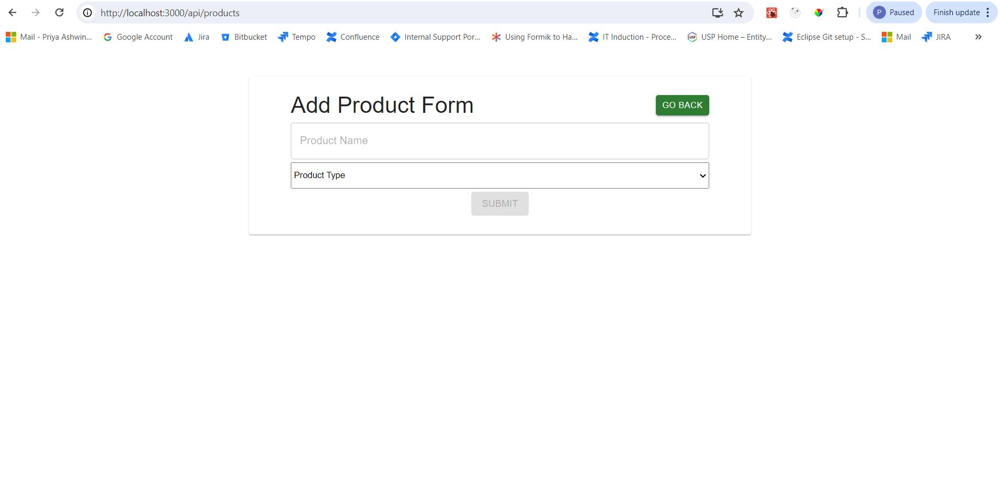
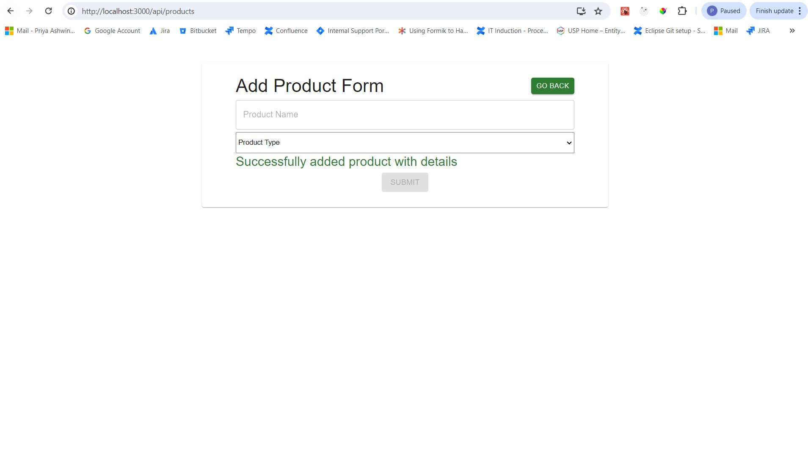

# react-take-home

### Submission details

### Client

Please install the dependency for the client by using the command npm install by moving to the directioy .../react-take-home-main/client

### Server

Please install the dependency for the server by using the command npm install in the directory path .../react-take-home-main

### Client

I've developed the client app for the Products using React functional components, formik and mui 5.

### Server

I've included cors middleware in the server to support fetch from the client of any of the below method
GET
HEAD
PUT
PATCH
POST
DELETE

### Components in client

productsList - With the help of fetch the component retrives the data through the api http://localhost:8080/api/products from the server. On the header it has a button for adding a new product and onclick it will navigate to the add product form page. On each product there is a edit product button and onclick it navigates to the edit product form page.

avatarCaption - This component help to render the avatar for the product based on product type

productDetails - This component updates the product based on the id. The product name is checked for the uniquenesson change of the field by the POST of the api http://localhost:8080/api/validate/ and on successful update of the product to the api http://localhost:8080/api/products/1 a success message appears and resets the form. As per the acceptance criteria the Size, feature and brand field appears on the selection of the product type. The options in the size dropdown are based on the product type selected. The Go Back button appears on the header to navigate back to the home page. The update button will be enabled only if the user fills in the details otherwise it will be diabled to avoid the empty update of the product.

addProduct - This component adds a products to the api http://localhost:8080/api/products using POST and renders the success message after the successful add operation. As per the acceptance criteria the Size, feature and brand field appears on the selection of the product type. The options in the size dropdown are based on the product type selected. The Go Back button appears on the header to navigate back to the home page. The submit button will be enabled only if the user fills in the details otherwise it will be diabled to avoid the empty add of the product.

