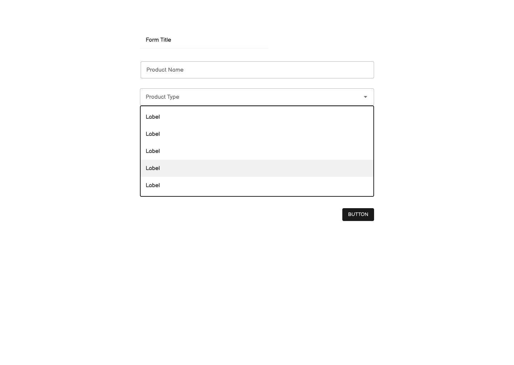
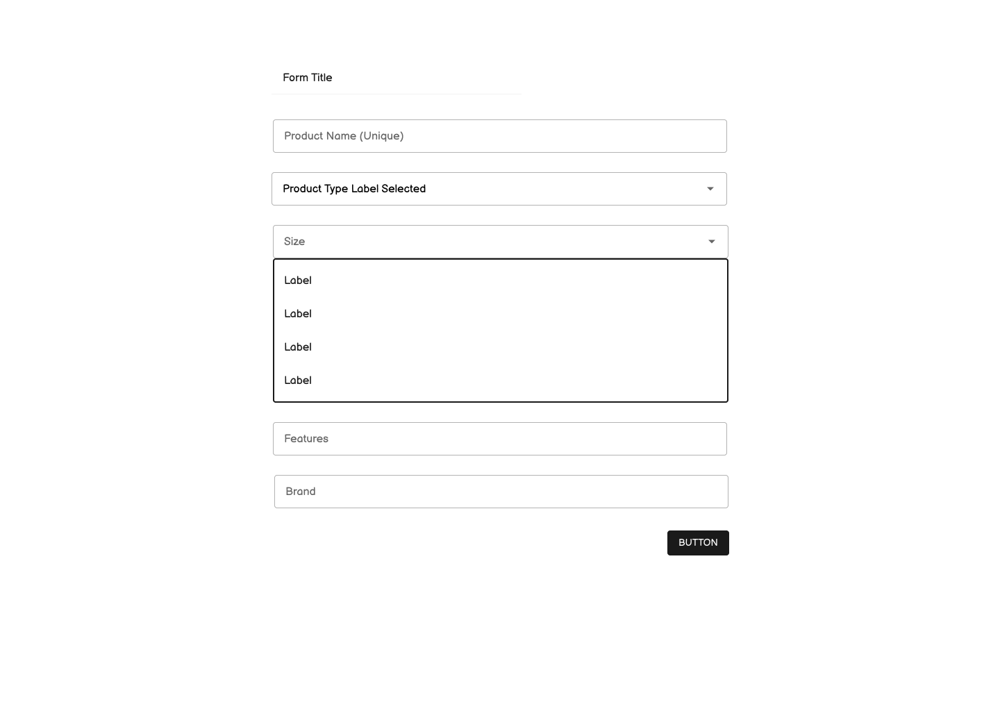

# react-take-home

React take home task for Sr. Frontend Dev role

Thank you for your application to SearchPilot! We greatly appreciate you taking the time to apply and your interest in working with us.

We have created a take home task and thank you taking the time to complete SearchPilot take-home challenge for our senior frontend developer role.

The task should hopefully not take too long. If you have any questions at all, please don’t hesitate to reach out to us.

The goal of this take home task is to build out a product list and product form. Please clone this repository: https://github.com/SearchPilot/react-take-home

### Task

- Display a list of products (Endpoint: `GET /api/products` and individual product endpoint: `GET /api/products/:id`)
- When user clicks on a product, user gets taken to a dynamic form and should see a form where they can edit product detail. Form should have these input fields:
  - Product name (User should be able to validate a unique product name `POST /api/validate`)
  - Product type
  - When product type is selected, user should then see options such as:
    - Size
    - Features
    - Brand
- Save the form (Endpoints: `PUT /api/products/:id`) - Please see the product detail page low fidelity mockup
- On the product list page, user can add a new product, which takes you to the product detail form page (Endpoint: `POST /api/products`)
- If anything appears ambiguous, please make your own choice on how to proceed. If there appears to be a roadblock of some sort, please do email us.

### Requirements

- Use React to build the frontend of the web application
- Implement all of the features shown in the design mockup and task list
- Ensure that the application is responsive and works on all devices
- Write clean, maintainable code that adheres to best practices

### Submission

Please submit your completed task as a GitHub repository or a CodeSandbox. Include instructions on how to run your application and any additional notes or comments that you think are relevant.

### Design Mockup

Product Detail Forms

Product Details Pages:

Feel free to design/style the list of products as you wish.

### Submission details

### Client

Please install the dependency for the client by using the command npm install by moving to the directioy .../react-take-home-main/client

### Server

Please install the dependency for the server by using the command npm install in the directory path .../react-take-home-main

### Client

I've developed the client app for the Products using React functional components, formik and mui 5.

### Server

I've included cors middleware in the server to support fetch from the client of any of the below method
GET
HEAD
PUT
PATCH
POST
DELETE

### Components in client

productsList - With the help of fetch the component retrives the data through the api http://localhost:8080/api/products from the server. On the header it has a button for adding a new product and onclick it will navigate to the add product form page. On each product there is a edit product button and onclick it navigates to the edit product form page.

avatarCaption - This component help to render the avatar for the product based on product type

productDetails - This component updates the product based on the id. The product name is checked for the uniquenesson change of the field by the POST of the api http://localhost:8080/api/validate/ and on successful update of the product to the api http://localhost:8080/api/products/1 a success message appears and resets the form. As per the acceptance criteria the Size, feature and brand field appears on the selection of the product type. The options in the size dropdown are based on the product type selected. The Go Back button appears on the header to navigate back to the home page. The update button will be enabled only if the user fills in the details otherwise it will be diabled to avoid the empty update of the product.

addProduct - This component adds a products to the api http://localhost:8080/api/products using POST and renders the success message after the successful add operation. As per the acceptance criteria the Size, feature and brand field appears on the selection of the product type. The options in the size dropdown are based on the product type selected. The Go Back button appears on the header to navigate back to the home page. The submit button will be enabled only if the user fills in the details otherwise it will be diabled to avoid the empty add of the product.

